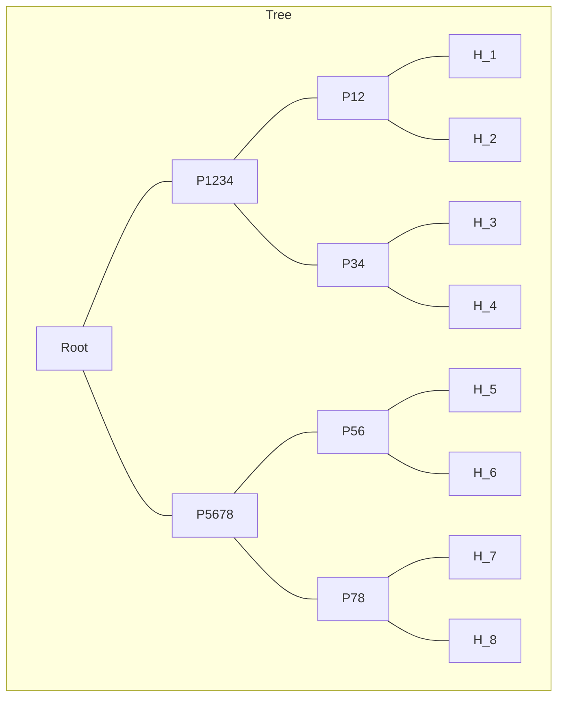

# dCypher Recryption

[description](https://identikey.io/recryption)

## IdentiKey Message Specification

The IdentiKey Message Specification provides a secure, verifiable, and chunkable format for transmitting data. It is inspired by PGP's ASCII armor and leverages Merkle trees for efficient content integrity verification, similar to BitTorrent's BEP 30.

This format is designed to encapsulate data, such as ciphertexts from the proxy re-encryption library, for transmission.

### Architectural Assumptions

* **CryptoContext:** All cryptographic operations (encryption, decryption, key generation) depend on a shared `CryptoContext`. This specification assumes that the recipient has access to the *exact same* `CryptoContext` used by the sender. This context is expected to be managed and transmitted out-of-band and is not part of the message payload itself.
* **Public Keys:** To verify a signature, the recipient must have access to the sender's public key. This key is also assumed to be known beforehand, likely through a trusted key directory or a previous exchange.

### Format Overview

An IdentiKey message is composed of one or more parts. Each part is a standalone text block that can be transmitted separately.

```text
----- BEGIN IDK MESSAGE PART <part_num>/<total_parts> -----
<headers>

<base64_encoded_payload>
----- END IDK MESSAGE PART <part_num>/<total_parts> -----
```

### Headers

The headers are in `Key: Value` format.

#### Mandatory Headers (in every part)

* `Version`: The version of the message specification. Current version is 0.
* `SlotsTotal`: The total number of available slots per ciphertext, as determined by the `CryptoContext`.
* `SlotsUsed`: The total number of coefficients (or slots) in the original data vector. This is used to correctly truncate the decrypted vector before byte conversion.
* `BytesTotal`: The total size in bytes of the original, unencoded message data. This is critical for correctly truncating the data after decryption.
* `MerkleRoot`: The BLAKE2b hash of the root of the Merle tree. This also serves as the unique identifier for the message.
* `Signature`: An ECDSA signature of the canonicalized headers, to authenticate the metadata.

#### Part-specific Headers

* `Part`: The sequence number of this part and the total number of parts (e.g., `1/5`).
* `AuthPath`: A JSON-encoded list of hashes. These are the sibling hashes required to compute the `MerkleRoot` from the pieces contained in this part. The hashes are ordered from the leaves of the tree towards the root.

#### Optional Headers

* `Comment`: A human-readable comment.
* `CharacterSet`: The character set of the original data. Defaults to `UTF-8`.

### Encryption and Piece Creation

The raw message data is first encrypted using the proxy re-encryption library. The encryption process produces a list of serializable ciphertext objects. Each of these objects is then serialized into a string (e.g., Base64). These serialized strings are the fundamental "pieces" of the message.

The `TotalSize` header must be set to the size in bytes of the original, pre-encryption data. The `SlotsUsed` header must be set to the number of coefficients in the vector that was encrypted. The `SlotsTotal` header must be set to the value returned by `get_slot_count()` for the `CryptoContext`.

### Payload

The payload of each part contains one or more of the serialized ciphertext pieces, concatenated and then encoded in Base64. A JSON array of the Base64 strings is also a valid representation.

### Merkle Tree and Message Assembly

1. A Merkle tree is constructed from the hashes of the ciphertext pieces. The BLAKE2b hash of each piece is calculated to form the leaves of the tree.
2. The tree is constructed by recursively hashing pairs of nodes until a single root hash, the `MerkleRoot`, is obtained. If there is an odd number of nodes at any level, the last node is paired with a zero-filled hash of the same length. The hashing algorithm for internal nodes is `BLAKE2b(hash(left_child) + hash(right_child))`.
3. The message is split into one or more parts for transmission. Each part's payload will contain one or more of the ciphertext pieces.
4. The headers for each part are created, including the `AuthPath` required to verify the pieces contained within that part.

### Signature Generation

The `Signature` field provides authenticity for the message parameters.

1. A canonical text representation of the headers is created. This includes `Version`, `SlotsTotal`, `SlotsUsed`, `TotalSize`, and `MerkleRoot`. The headers are ordered alphabetically by key.

    ```
    MerkleRoot: <hash>
    SlotsTotal: <count>
    SlotsUsed: <length>
    BytesTotal: <size>
    Version: 0
    ```

2. The canonical text is hashed with SHA-256.
3. The hash is signed using ECDSA with the sender's private key.

### Decryption and Verification

A recipient performs the following steps:

1. For each message part received, verify the integrity of its payload. This is done by hashing the ciphertext pieces in the payload and using the `AuthPath` to recalculate a root hash, which is then compared against the `MerkleRoot` header.
2. Once all parts are received and verified, extract and assemble the list of all ciphertext pieces.
3. Deserialize and decrypt the ciphertext pieces using the appropriate key and the `SlotsUsed` from the header. The crypto library will return a vector of coefficients, correctly truncated to `SlotsUsed`.
4. If the original data was a byte stream, convert the coefficient vector to bytes.
5. Use the `BytesTotal` header value to truncate the resulting data to its original byte length, removing any final padding. This step is critical for recovering the exact original message.

### Example

Consider a message that, after encryption, results in 8 ciphertext pieces. We'll transmit these in 4 parts (2 pieces per part). The Merkle tree is built on the hashes of these ciphertext pieces, where `H_n` is the hash of `Ciphertext Piece n`, and `P_xy` is the hash of its children.



If a recipient receives `Part 1/4`, it contains `Ciphertext Piece 1` and `Ciphertext Piece 2`.

1. The recipient decodes the payload to get the two ciphertext piece strings. It hashes them to get `H1` and `H2`, then computes `P12 = hash(H1 + H2)`.
2. To verify this against the `MerkleRoot`, the recipient needs the sibling hashes up the tree. The `AuthPath` provides these.
3. The first hash needed is the sibling of `P12`, which is `P34`. The recipient computes `P1234 = hash(P12 + P34)`.
4. The next hash needed is the sibling of `P1234`, which is `P5678`. The recipient computes `Root = hash(P1234 + P5678)`.
5. This computed `Root` is compared to the `MerkleRoot` in the header to verify integrity.

Once all parts are verified and all 8 ciphertext pieces are collected, they are decrypted using the `SlotsUsed`, and the resulting plaintext is truncated to the `BytesTotal` specified in the header.

The message for `Part 1/8` would look like this (note that `SlotsUsed` and `SlotsTotal` are example values and depend on the original data and `CryptoContext`):

```text
----- BEGIN IDK MESSAGE PART 1/8 -----
Version: 0
SlotsTotal: 1024
SlotsUsed: 1024
BytesTotal: 8192
MerkleRoot: <blake2b_root_hash_for_all_8_pieces>
Signature: <ecdsa_signature>
Part: 1/8
AuthPath: ["<hash_P12>", "<hash_P1234>"]

<base64_encoded_payload_of_ciphertext_piece_1>
----- END IDK MESSAGE PART 1/8 -----
<...>
----- BEGIN IDK MESSAGE PART 8/8 -----
Version: 0
SlotsTotal: 1024
SlotsUsed: 512
BytesTotal: 8192
MerkleRoot: <blake2b_root_hash_for_all_8_pieces>
Signature: <ecdsa_signature>
Part: 8/8
AuthPath: ["<hash_P78>", "<hash_P5678>"]

<base64_encoded_payload_of_ciphertext_piece_7>
----- END IDK MESSAGE PART 8/8 -----
```
